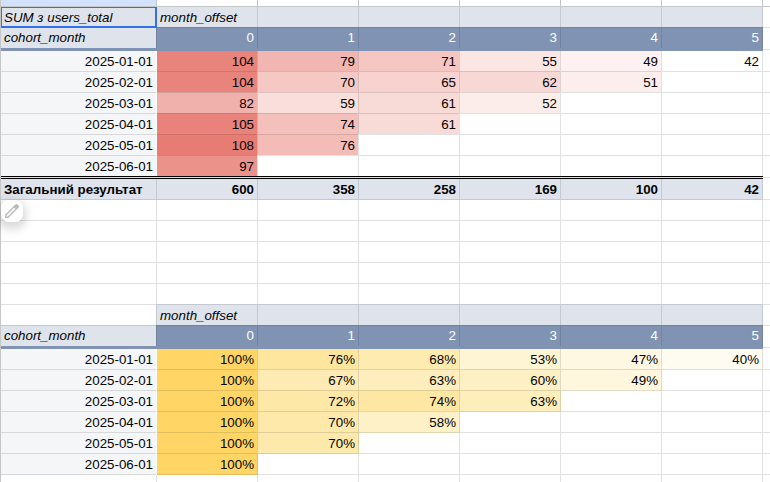
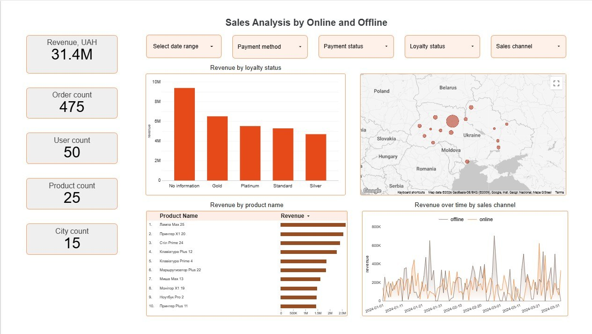
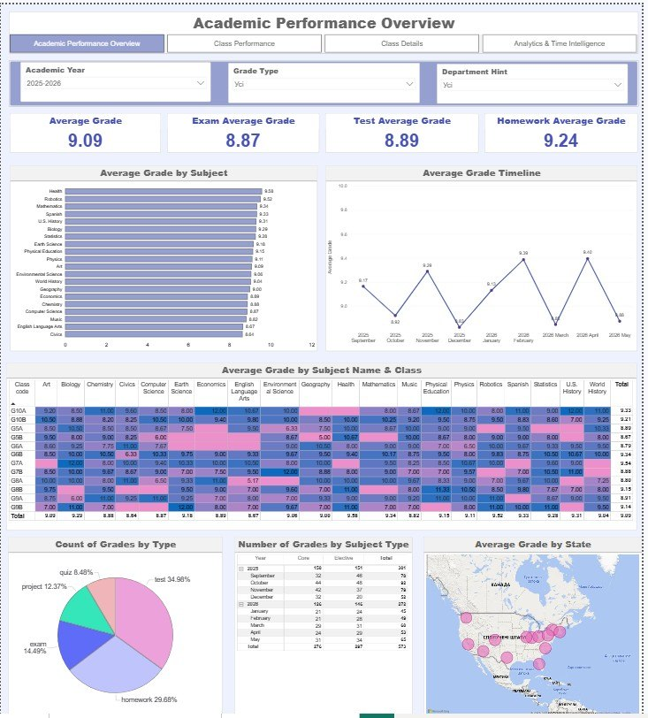

# 👋 Hi, I'm Olha Rudnieva

## Junior Data Analyst | Economics & Business Analysis | SQL • Power BI • Data Visualization

📄 [Resume (EN)](./cv/CV_DA_Eng_Rudnieva_Olha.pdf) &nbsp;•&nbsp; [Resume (ATS)](./cv/CV_DA_ATS_Rudnieva_Olha.pdf) &nbsp;•&nbsp; [Резюме (UA)](./cv/CV_DA_Ukr_Rudnieva_Olha.pdf) &nbsp;•&nbsp; 💼 [LinkedIn](https://www.linkedin.com/in/olha-rudnieva-2b6838418/) &nbsp;•&nbsp; 📧 [olia.v.rudneva@gmail.com](mailto:olia.v.rudneva@gmail.com)

Welcome to my Data Analytics portfolio.

After more than 20 years of working in economics, financial planning, business reporting, and operational analysis within a large industrial enterprise, I decided to transition into Data Analytics.

Throughout my career, I have worked with business data every day—analyzing costs, forecasting performance, preparing management reports, monitoring KPIs, and supporting business decision-making. Today I combine this practical business experience with modern analytical tools such as SQL, Power BI, Tableau, and Data Studio.

I believe that good analytics is not only about building dashboards—it is about understanding business processes, discovering meaningful insights, and helping companies make better decisions.

---

# 🛠 Technical Skills

### Data Analysis

* SQL (BigQuery, PostgreSQL)
* Microsoft Excel
* Google Sheets
* Python *(Learning: Pandas, NumPy, Matplotlib, Seaborn, Jupyter Notebook)*

### Business Intelligence

* Power BI
* Data Studio (formerly Looker Studio)
* Tableau
* Power Query
* DAX

### Analytics

* Data Cleaning
* Data Modeling
* Data Visualization
* Dashboard Development
* Business Intelligence
* Cohort Analysis
* KPI Monitoring
* ETL Processes
* A/B Testing
* Data Storytelling

---

# 📂 Portfolio Projects

## 📊 User Retention & Cohort Analysis

SQL • PostgreSQL • Google Sheets

Business analysis of customer retention using cohort analysis.

**Highlights**

* Data cleaning and transformation
* SQL CASE expressions
* Cohort matrix
* Retention Rate calculation
* Marketing segmentation

**Result:** By Month 5, organic users retained 56% vs. just 9% for promo users — exposing low-quality promo acquisition and pointing to onboarding and acquisition-cost fixes.

➡️ [Open Project →](./projects/user_retention/README.md) &nbsp;•&nbsp; 📊 [Live cohort dashboard](https://docs.google.com/spreadsheets/d/1izFDyh0IKHF2RubBb7z4JZSIkfAUlAxoYfWGFws4EXM/edit?gid=0#gid=0)

---

## 📈 Sales Analysis Dashboard

SQL • Data Studio

Interactive executive dashboard for sales analysis.

**Highlights**

* SQL JOINs
* KPI dashboards
* Revenue analysis
* Interactive filtering
* Business Intelligence reporting

➡️ [Open Project →](./projects/sales_analysis_dashboard/README.md)

---

## 📉 Interactive Academic Performance Overview Dashboard

Power BI • DAX • Power Query

End-to-end Power BI report on student academic performance, built on a star schema with advanced DAX.

**Highlights**

* Star Schema
* DAX Measures
* KPI Monitoring
* Time Intelligence (MoM%, YTD)

**Result:** Surfaced a December performance dip (8.83) that rebounded +3.47% MoM in January, and flagged underperforming classes (G5B, G8A) and subjects for targeted support.

➡️ [Open Project →](./projects/academic_performance_overview_dashboard/README.md) &nbsp;•&nbsp; 📄 [View report (PDF)](./projects/academic_performance_overview_dashboard/Academic_Performance_Overview_Dashboard.pdf)

---

# 🧭 Skills Demonstrated

| Skill                                    | Where to see it |
|:-----------------------------------------| :--- |
| SQL (data cleaning, CASE, date parsing)  | [User Retention](./projects/user_retention/README.md) |
| Cohort analysis & Retention Rate         | [User Retention](./projects/user_retention/README.md) |
| SQL JOINs & calculated metrics           | [Sales Analysis](./projects/sales_analysis_dashboard/README.md) |
| Data Studio dashboards & cross-filtering | [Sales Analysis](./projects/sales_analysis_dashboard/README.md) |
| Star-schema modeling & ETL (Power Query) | [Academic Performance](./projects/academic_performance_overview_dashboard/README.md) |
| DAX & Time Intelligence (MoM%, YTD)      | [Academic Performance](./projects/academic_performance_overview_dashboard/README.md) |

---

# 🎓 Education

**Master's Degree**

Enterprise Economics (Engineer-Economist)

Volodymyr Dahl East Ukrainian National University

---

# 📚 Professional Development

* Data Analytics Professional Course — GoIT *(In Progress)*
* Google AI for Business ([certificate](./certificates/Rudnieva_AI.pdf))

---

# 🌍 Languages

* 🇺🇦 Ukrainian — Native
* 🇬🇧 English — Intermediate (B1) ([certificate](./certificates/EnglishB1.jpg))

---

⭐ Thank you for visiting my portfolio. I am currently open to Junior Data Analyst opportunities where I can combine my business background with modern data analytics to help companies make better data-driven decisions.

