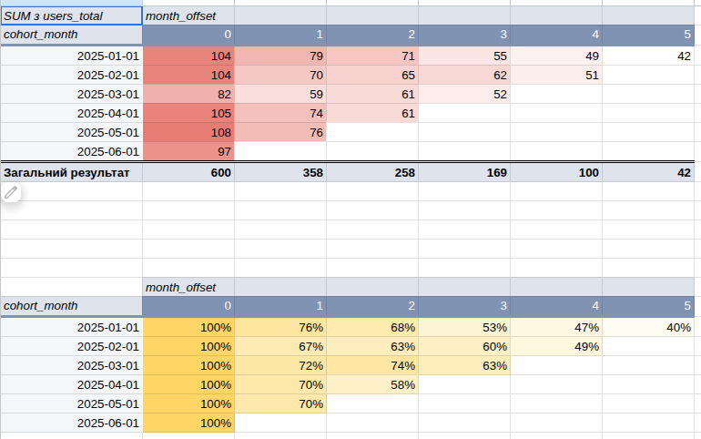
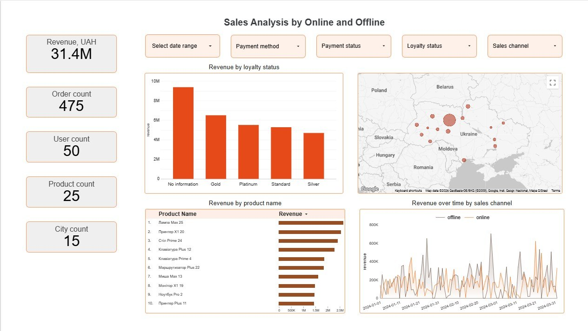
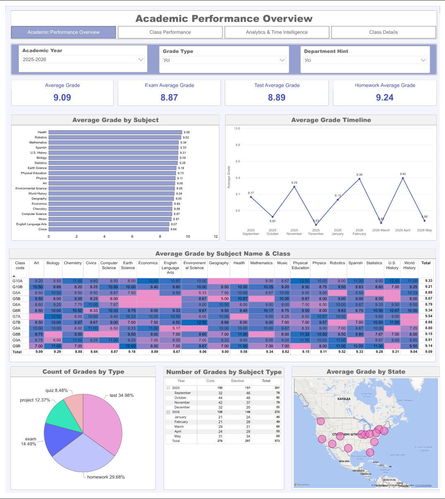

# 👋 Hi, I'm Olha Rudnieva

## Junior Data Analyst | Economics & Business Analysis | SQL • Tableau • Power BI • Data Visualization

📄 [Resume (EN) ⬇](./cv/CV_DA_Eng_Rudnieva_Olha.pdf?raw=1) &nbsp;•&nbsp; [Resume (ATS) ⬇](./cv/CV_DA_ATS_Rudnieva_Olha.pdf?raw=1) &nbsp;•&nbsp; [Резюме (UA) ⬇](./cv/CV_DA_Ukr_Rudnieva_Olha.pdf?raw=1) &nbsp;•&nbsp; 💼 [LinkedIn](https://www.linkedin.com/in/olha-rudnieva-2b6838418/) &nbsp;•&nbsp; 📊 [Tableau Public](https://public.tableau.com/app/profile/olha.rudnieva/vizzes) &nbsp;•&nbsp; 📧 [olia.v.rudneva@gmail.com](mailto:olia.v.rudneva@gmail.com)

Welcome to my Data Analytics portfolio.

After more than 20 years of working in economics, financial planning, business reporting, and operational analysis within a large industrial enterprise, I decided to transition into Data Analytics.

Throughout my career, I have worked with business data every day—analyzing costs, forecasting performance, preparing management reports, monitoring KPIs, and supporting business decision-making. Today I combine this practical business experience with modern analytical tools such as SQL, Power BI, Tableau, and Data Studio.

I believe that good analytics is not only about building dashboards—it is about understanding business processes, discovering meaningful insights, and helping companies make better decisions.

---

# 🛠 Technical Skills

### Data Analysis

* SQL (BigQuery, PostgreSQL)
* Advanced SQL (CTEs, Window Functions, CASE logic)
* Microsoft Excel
* Google Sheets
* Python *(Learning: Pandas, NumPy, Matplotlib, Seaborn, Jupyter Notebook)*

### Business Intelligence

* Power BI
* Data Studio (formerly Looker Studio)
* Tableau
* Power Query
* DAX

### Analytics

* Data Cleaning
* Data Modeling
* Data Visualization
* Dashboard Development
* Business Intelligence
* Cohort Analysis
* Retention & Churn Analysis
* SaaS / Product Metrics (MRR, ARPPU, LTV, Churn Rate)
* Unit Economics
* Marketing & Funnel Analytics (CTR, CPC, CPL, ROMI)
* KPI Monitoring
* ETL Processes
* A/B Testing
* Data Storytelling

---

# 📂 Portfolio Projects

## 💰 Revenue Metrics Dashboard

SQL • PostgreSQL • Tableau

Monitoring of recurring revenue for a SaaS product, decomposing MRR change into its five underlying factors.

**Highlights**

* Window functions (`LAG`, `LEAD`) for period-over-period comparison
* MRR factor classification (New, Expansion, Contraction, Churn, Back from Churn)
* Unit economics: ARPPU, LT, LTV, Churn Rate, Revenue Churn Rate
* Churn dated in SQL so every measure stays a plain `SUM()` and the date filter holds at any selection
* KPI cards with dynamic titles (`LAST() = 0`) that name the month they report
* Parameter-driven trend chart across 17 metrics

**Result:** Exposed a "leaky bucket" — December's $2,981 of new and expansion MRR was fully absorbed by $4,328 of contraction and churn, leaving Net New MRR at just $15 against $8,440 of MRR, while User Churn Rate climbed from 25.6% to a 35.7% peak in November.

➡️ [Open Project →](./projects/revenue_metrics_dashboard/README.md) &nbsp;•&nbsp; 📊 [Live Tableau dashboard](https://public.tableau.com/app/profile/olha.rudnieva/viz/RevenueMetricsFilter/RevenueMetrics) &nbsp;•&nbsp; 📄 [Presentation](https://canva.link/ofl5ozg8gzwzd96) ([PDF](./projects/revenue_metrics_dashboard/Revenue%20Metrics%20Dashboard.pdf))

---

## 📢 Marketing Performance Analysis

SQL • PostgreSQL • Tableau

Cross-channel analysis of Facebook Ads and Google Ads efficiency, from raw ad logs to an interactive Tableau dashboard.

**Highlights**

* SQL UNION ALL & cross-platform data blending
* UTM parameter parsing & URL decoding
* Calculated fields (CTR, CPC, CPM, CPL, ROMI)
* LOD expressions & interactive parameters
* Budget reallocation analysis

**Result:** Found a strong 0.78 spend-to-lead correlation and identified `Brand` campaigns as the CPL outlier, recommending budget shift toward lower-cost `Expansion` campaigns.

➡️ [Open Project →](./projects/marketing_performance_analysis/README.md) &nbsp;•&nbsp; 📊 [Live Tableau dashboard](https://public.tableau.com/app/profile/olha.rudnieva/viz/Project2Tableau_17853332767450/MarketingPerformanceDashboard)

---

## 📊 User Retention & Cohort Analysis

SQL • PostgreSQL • Google Sheets

Business analysis of customer retention using cohort analysis.

**Highlights**

* Data cleaning and transformation
* SQL CASE expressions
* Cohort matrix
* Retention Rate calculation
* Marketing segmentation

**Result:** By Month 5, organic users retained 56% vs. just 9% for promo users — exposing low-quality promo acquisition and pointing to onboarding and acquisition-cost fixes.

➡️ [Open Project →](./projects/user_retention/README.md) &nbsp;•&nbsp; 📊 [Live cohort dashboard](https://docs.google.com/spreadsheets/d/1izFDyh0IKHF2RubBb7z4JZSIkfAUlAxoYfWGFws4EXM/edit?gid=0#gid=0)

---

## 📈 Sales Analysis Dashboard

SQL • Data Studio

Interactive executive dashboard for sales analysis.

**Highlights**

* SQL JOINs
* KPI dashboards
* Revenue analysis
* Interactive filtering
* Business Intelligence reporting

**Result:** Tracked 31.4M UAH across 475 orders in Q1 2024 and found that the single largest revenue bucket (~9.3M UAH, ~30%) carries no loyalty status at all — a data-quality gap that blocks segment analysis, while the named tiers (Gold 6.4M → Silver 4.6M) differentiate spend far less than expected.

➡️ [Open Project →](./projects/sales_analysis_dashboard/README.md)

---

## 📉 Interactive Academic Performance Overview Dashboard

Power BI • DAX • Power Query

End-to-end Power BI report on student academic performance, built on a star schema with advanced DAX.

**Highlights**

* Star Schema
* DAX Measures
* KPI Monitoring
* Time Intelligence (MoM%, YTD)

**Result:** Surfaced a December performance dip (8.83) that rebounded +3.47% MoM in January, and flagged underperforming classes (G5B, G8A) and subjects for targeted support.

➡️ [Open Project →](./projects/academic_performance_overview_dashboard/README.md) &nbsp;•&nbsp; 📄 [View report (PDF)](./projects/academic_performance_overview_dashboard/Academic_Performance_Overview_Dashboard.pdf)

---

## 🐍 Python Practice Notebooks *(learning in progress)*

Python • pandas • Matplotlib • Seaborn • Jupyter

Not a portfolio case study — coursework notebooks kept here as honest evidence of where my Python currently stands: pandas data cleaning and grouping on the Titanic dataset, and daily / campaign-level analysis of a Facebook Ads dataset (ROMI, CTR, CPC) with Matplotlib and Seaborn charts, a correlation heatmap, and a regression scatter.

➡️ [Browse the notebooks →](./projects/python/README.md)

---

## 🗄 SQL Query Library *(exercises)*

PostgreSQL • BigQuery

Not a case study — the working SQL behind the projects above plus coursework query sets: PostgreSQL exercises on the e-commerce schema that feeds the Sales Analysis dashboard (aggregation, `HAVING`, subqueries, `COALESCE`, `UNION ALL`, `INTERSECT`, CTE chains, online-vs-offline basket comparison) and a BigQuery set on Google's public GA4 sample dataset (`UNNEST` of nested event arrays, wildcard tables, `COUNTIF`, ranking window functions). Comments are bilingual Ukrainian / English.

➡️ [Browse the queries →](./projects/sql/README.md)

---

# 🚧 In Progress

The next three projects, each with a written brief before a line of code — scope, data model, metric formulas, and acceptance criteria. Briefs are in Ukrainian.

| Project | What it will demonstrate | Brief |
| :--- | :--- | :--- |
| **A/B Test: Checkout Redesign** | Hypothesis testing in Python — SRM check, z-test & χ², confidence intervals, MDE and power, ship / don't-ship decision | [Task_UA.md](./projects/ab_test_checkout/Task_UA.md) |
| **Plan vs Actual: Cost Variance Analysis** | Manufacturing cost variance decomposed into price, quantity, volume and mix factors — the analysis I ran for 20 years as an engineer-economist, rebuilt in SQL + Power BI | [Task_UA.md](./projects/cost_variance_analysis/Task_UA.md) |
| **Public Procurement Efficiency (Prozorro)** | Real open Ukrainian data — Python ETL from the Prozorro API, competition vs savings, bootstrap confidence intervals | [Task_UA.md](./projects/prozorro_procurement_efficiency/Task_UA.md) |

---

# 🧭 Skills Demonstrated

| Skill                                    | Where to see it |
|:-----------------------------------------| :--- |
| SQL (data cleaning, CASE, date parsing)  | [User Retention](./projects/user_retention/README.md) |
| Cohort analysis & Retention Rate         | [User Retention](./projects/user_retention/README.md) |
| SQL JOINs & calculated metrics           | [Sales Analysis](./projects/sales_analysis_dashboard/README.md) |
| Data Studio dashboards & cross-filtering | [Sales Analysis](./projects/sales_analysis_dashboard/README.md) |
| Star-schema modeling & ETL (Power Query) | [Academic Performance](./projects/academic_performance_overview_dashboard/README.md) |
| DAX & Time Intelligence (MoM%, YTD)      | [Academic Performance](./projects/academic_performance_overview_dashboard/README.md) |
| Tableau (LOD, parameters, filter actions) | [Marketing Performance](./projects/marketing_performance_analysis/README.md) |
| Marketing KPIs (CPL, ROMI) & attribution | [Marketing Performance](./projects/marketing_performance_analysis/README.md) |
| SQL window functions (`LAG`, `LEAD`) & CTE chains | [Revenue Metrics](./projects/revenue_metrics_dashboard/README.md) |
| SaaS unit economics (MRR, ARPPU, LTV, Churn Rate) | [Revenue Metrics](./projects/revenue_metrics_dashboard/README.md) |
| Tableau parameters, dynamic KPI titles & dashboard navigation | [Revenue Metrics](./projects/revenue_metrics_dashboard/README.md) |
| Python basics: pandas, Matplotlib, Seaborn *(learning)* | [Python Notebooks](./projects/python/README.md) |

---

# 🎓 Education

**Master's Degree**

Enterprise Economics (Engineer-Economist)

Volodymyr Dahl East Ukrainian National University

---

# 📚 Professional Development

* Data Analytics Professional Course — GoIT *(In Progress)*
* Google AI for Business ([certificate ⬇](./certificates/Rudnieva_AI.pdf?raw=1))

---

# 🌍 Languages

* 🇺🇦 Ukrainian — Native
* 🇬🇧 English — Intermediate (B1) ([certificate ⬇](./certificates/EnglishB1.jpg?raw=1))

---

⭐ Thank you for visiting my portfolio. I am currently open to Junior Data Analyst opportunities where I can combine my business background with modern data analytics to help companies make better data-driven decisions.

