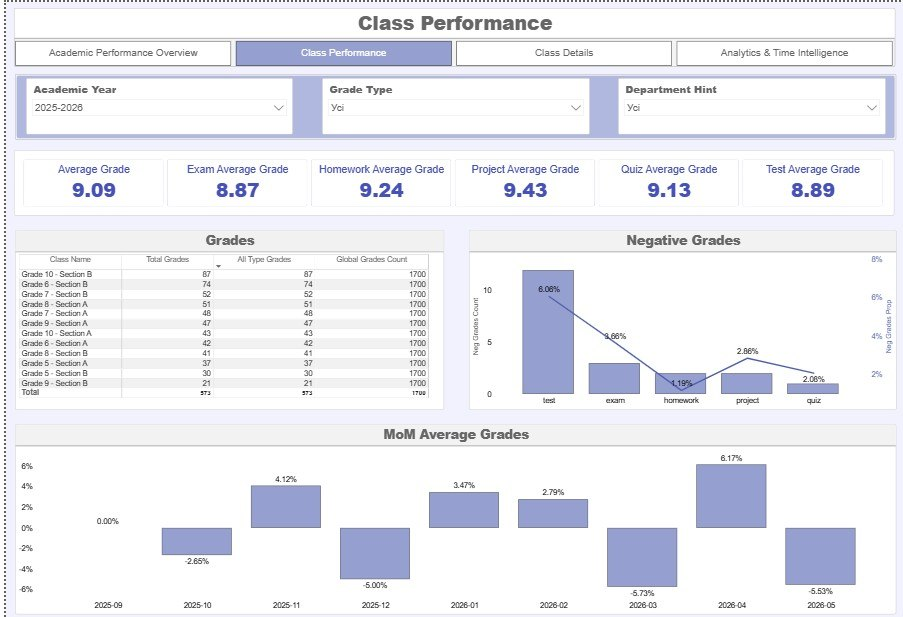
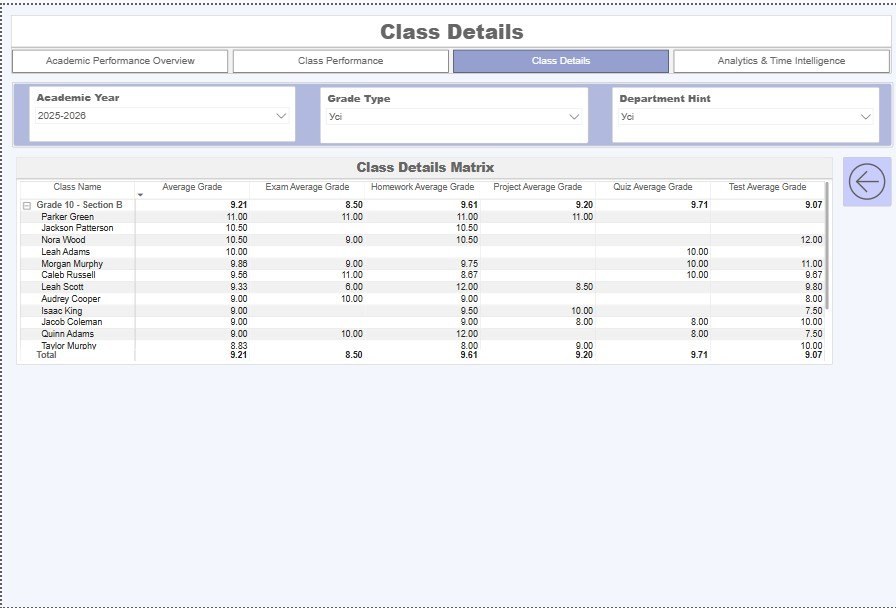
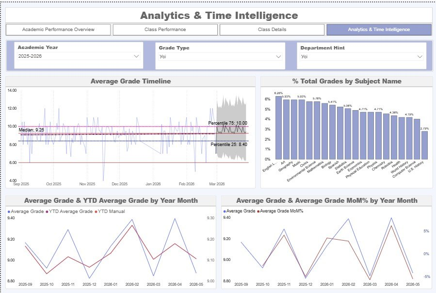

# Interactive Academic Performance Overview Dashboard

An end-to-end Power BI project that turns raw school grade-book data into an interactive analytical report. It covers the full development lifecycle: multi-source ETL and data cleaning, relational star-schema modeling, DAX measures, interactive report design, and built-in time-intelligence forecasting.

🔗 **View the report (PDF):** [Academic_Performance_Overview_Dashboard.pdf](Academic_Performance_Overview_Dashboard.pdf) — full report, no Power BI needed
📂 **Source file:** [Academic_Performance_Overview_Dashboard.pbix](Academic_Performance_Overview_Dashboard.pbix) — open in Power BI Desktop

> **Note:** This project uses school academic data; the same modeling, DAX, and reporting techniques transfer directly to business KPI reporting.

## Executive Summary

* **Stable overall performance:** The system-wide **Average Grade is 9.09**. Students score highest on **Homework (9.24)**, while **Exams (8.87)** and **Tests (8.89)** lag slightly — pointing to higher difficulty or pressure during formal evaluations.
* **Subject-level disparities:** Practical subjects lead the ranking — **Health (9.58)** and **Robotics (9.52)** — while core humanities such as **English Language Arts (8.87)** and **Civics (8.64)** show the lowest averages, flagging areas that may need curriculum adjustment.

## Key Insights & Anomalies

* **The December drop:** Time-intelligence analysis surfaced a significant dip in **December 2025 (low of 8.83)**, tied to end-of-semester fatigue and exam workload. The trend rebounded sharply to **9.13 in January 2026 — a +3.47% Month-over-Month gain**.
* **Class performance variance:** Matrix conditional formatting highlights performance "hotspots" across classes. **G10A** holds a consistently high benchmark (scores concentrated in the 11.00–12.00 range), whereas **G5B** and **G8A** drop severely in specific subjects (down to 5.17–6.33), signaling a need for targeted academic support.

## Project Architecture & Methodology

The development process was executed step-by-step across four main phases:

### Phase 1: ETL & Relational Data Modeling (Star Schema)
* **Data Extraction:** Imported raw relational school data from multiple transactional CSV sources: `students`, `classes`, `teachers`, `subjects`, `periods`, and `grades` (the central fact table).
* **Data Transformation (Power Query):** * Unified date formats using localized parsing parameters (`en-US`).
  * Validated data integrity by handling missing values, clearing text-to-numerical anomalies, and testing primary keys for duplicates.
* **Data Modeling:** Constructed a pure **Star Schema** with one-to-many, single-direction cross-filtering relationships. 
* **Time Dimension (DAX):** Engineered a continuous, dynamic `calendar` dimension table using DAX to drive all time-based aggregations, complete with hierarchical fields: `Year`, `Month`, `Month Number`, and `Year-Month`.

### Phase 2: Core Visualizations & Interactivity Configuration
* Built a clear overview layout with consistent data formatting and aligned analytical grids.
* **KPI Metrics:** Formatted key performance cards (`Average Grade`, `Exam Average Grade`, `Test Average Grade`, `Homework Average Grade`) with standardized decimal notation (`0.00`).
* **Interactivity Controls:** Configured page-level filtering constraints and explicitly isolated KPI scorecards from cross-filtering disruptions via **Edit Interactions** to preserve accurate baseline benchmarks during visual data exploration.

### Phase 3: Advanced DAX Context Engineering & Deep-Dive Analytics
* Developed an independent `_Measures` home table to centralize calculations.
* **Filter Context Manipulation:** Formatted custom metric calculations using `CALCULATE`, `ALL`, and `ALLEXCEPT` to accurately bypass or respect active slicer criteria (e.g., calculations that ignore specific `grade_type` fields while honoring global academic configurations).
* **Advanced User Journeys:** * Implemented horizontal, context-preserving **Drill-Through** paths mapping general metrics directly down to granular student profiles (`Class Details`).
  * Created dynamic visual popups via dedicated **Tooltip Pages** to surface performance variations without cluttering the canvas.

### Phase 4: Time Intelligence, Visual Forecasting & UX Navigation
* **Built-in Analytics:** Added 25th/75th percentiles, median markers, trend lines, and a 3-month continuous trend prediction model with a 95% confidence interval overlay.
* **Quick Calculations & Time Intelligence:**
  * Implemented native percentage-of-total distributions inside structural bar charts.
  * Generated complex Month-over-Month (`MoM%`) variance measures and Year-to-Date (`YTD`) cumulative runs, cross-validating automated Time-Intelligence functions against manually written DAX calculations (`TOTALYTD`).
* **UI/UX Standardization:** Deployed an intuitive layout matrix (Header -> Filter Controls -> KPI Grid -> Analysis Panel) paired with an explicit page navigation system that retains active filter contexts across all 5 report views.

---

## Report Structure & User Journey

The final product functions as a unified 5-page analytical report:
1. **Academic Performance Overview:** High-level dashboard highlighting core metrics, performance timelines, and subject breakdowns.
2. **Class Performance:** Operational overview focusing on class-by-class rankings, measure comparisons, and critical failure-rate indicators.
3. **Class Details:** A specialized drill-through landing page providing individual student performance profiling.
4. **Analytics & Time Intelligence:** Tracks rolling targets, time projections, and volume metrics.
5. **MoM%_AG_Details:** A dedicated background tooltips environment providing granular data on month-over-month performance shifts.

---

## Technical Specifications of Core DAX Measures

| Measure Name | Technical Logic / DAX Behavior | Slicer Interaction |
| :--- | :--- | :--- |
| `Average Grade` | Computes mean scores across filtered evaluations. | Ignores `grade_type` filters |
| `Exam / Homework / Project / Quiz / Test Average Grade` | Computes performance metrics isolated by evaluation category. | Ignores `grade_type` filters |
| `Neg Grades Count` / `Neg Grades Prop` | Measures total and percentage of unsatisfactory grades ($< 6$). | Responsive to all filters |
| `Total Grades` | Counts overall grade entries in the active context. | Responsive to all filters |
| `All Type Grades` | Measures general evaluation volume. | Ignores `grade_type` filter |
| `Global Grades Count` | Tallies system-wide evaluation volume across all dimensions. | Bypasses all active slicers |
| `Previous Grade` / `MoM_AG%` | Calculates previous period baselines and month-over-month shifts. | Responsive to time hierarchies |
| `YTD_Manual` | `TOTALYTD([Average Grade], calendar[Date])` | Tracks cumulative yearly performance |

---

## Dashboard Previews

### 1. Academic Performance Overview

### 2. Class Performance

### 3. Class Details

### 4. Analytics & Time Intelligence

