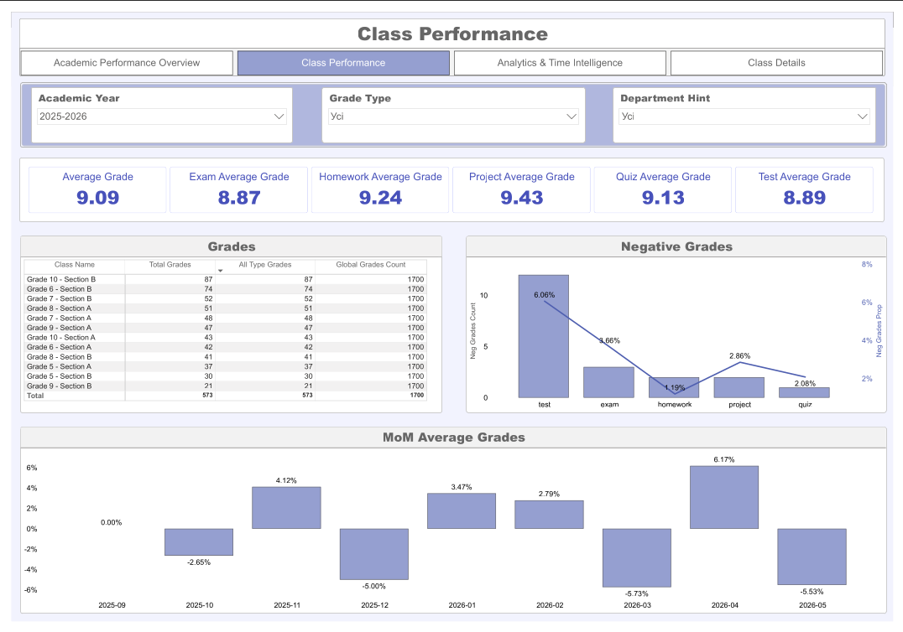
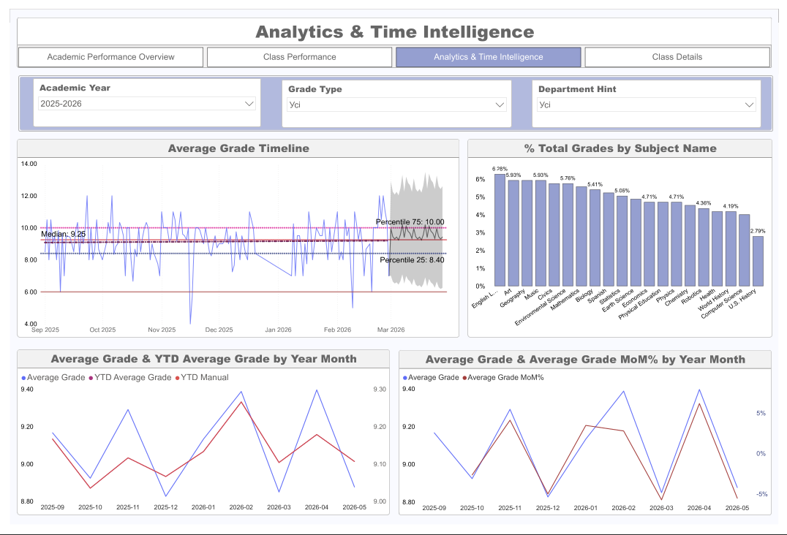
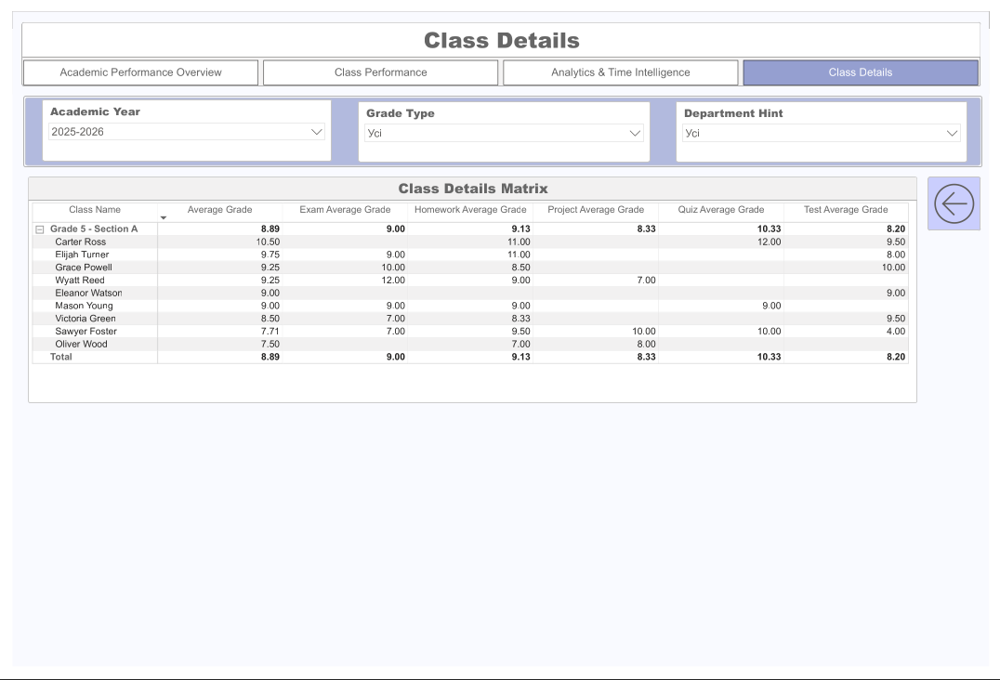

# Interactive Academic Performance Overview Dashboard

An end-to-end Power BI project that turns raw school grade-book data into an interactive analytical report. It covers the full development lifecycle: multi-source ETL and data cleaning, relational star-schema modeling, DAX measures, interactive report design, and built-in time-intelligence forecasting.

| | |
| :--- | :--- |
| **Role** | End-to-end: ETL and data cleaning, star-schema modelling, DAX measures, report build |
| **Tools** | Power BI Desktop, Power Query, DAX |
| **Data** | Synthetic training dataset (GoIT Data Analytics course) — six school grade-book CSV exports, graded on the 12-point scale |
| **Period covered** | September 2025 – February 2026 (2025/26 academic year) |
| **Deliverable** | 5-page Power BI report as PDF + `.pbix` source file |

🔗 **View the report (PDF):** [Academic_Performance_Overview_Dashboard.pdf](Academic_Performance_Overview_Dashboard.pdf) — full report, no Power BI needed
📂 **Source file:** [Academic_Performance_Overview_Dashboard.pbix](Academic_Performance_Overview_Dashboard.pbix) — open in Power BI Desktop

## Why this report exists

A principal or head of department has to decide where limited academic support goes, and the grade book alone does not answer that. This report points to the specific class-and-subject combinations that are underperforming (G5B and G8A fall to 5.17–6.33 in particular subjects, while G10A needs nothing), separates weak subject areas from weak assessment formats (formal exams and tests sit below homework everywhere, which is a format problem rather than a curriculum one), and shows whether the December dip is a structural end-of-semester effect or a real decline — the January rebound to 9.13 says it is the former, so the response is exam-period scheduling, not curriculum change.

> **Note:** This project uses school academic data; the same modeling, DAX, and reporting techniques transfer directly to business KPI reporting.

## Executive Summary

*All grades are on the Ukrainian 12-point scale, where anything below 6 counts as unsatisfactory.*

* **Stable overall performance:** The system-wide **Average Grade is 9.09**. Students score highest on **Homework (9.24)**, while **Exams (8.87)** and **Tests (8.89)** lag slightly — pointing to higher difficulty or pressure during formal evaluations.
* **Subject-level disparities:** Practical subjects lead the ranking — **Health (9.58)** and **Robotics (9.52)** — while core humanities such as **English Language Arts (8.87)** and **Civics (8.64)** show the lowest averages, flagging areas that may need curriculum adjustment.

## Key Insights & Anomalies

* **The December drop:** Time-intelligence analysis surfaced a significant dip in **December 2025 (low of 8.83)**, tied to end-of-semester fatigue and exam workload. The trend rebounded sharply to **9.13 in January 2026 — a +3.47% Month-over-Month gain**.
* **Class performance variance:** Matrix conditional formatting highlights performance "hotspots" across classes. **G10A** holds a consistently high benchmark (scores concentrated in the 11.00–12.00 range), whereas **G5B** and **G8A** drop severely in specific subjects (down to 5.17–6.33), signaling a need for targeted academic support.

## Project Architecture & Methodology

### Phase 1: ETL & Data Modeling (Star Schema)
* Imported six CSV sources — `students`, `classes`, `teachers`, `subjects`, `periods`, and `grades` as the fact table.
* Cleaned in Power Query: unified date parsing (`en-US` locale), handled missing values, fixed text-in-numeric columns, and tested primary keys for duplicates.
* Modelled as a star schema with one-to-many, single-direction relationships.
* Built a `calendar` dimension in DAX with `Year`, `Month`, `Month Number`, and `Year-Month` to drive every time-based aggregation.

### Phase 2: Core Visualizations & Interactivity
* KPI cards for `Average Grade`, `Exam`, `Test`, and `Homework Average Grade`.
* KPI scorecards excluded from cross-filtering via **Edit Interactions**, so the baseline benchmark stays fixed while the rest of the page responds to selections.

### Phase 3: DAX Filter-Context Work & Deep-Dive Paths
* Centralized all measures in a dedicated `_Measures` table.
* Used `CALCULATE` with `ALL` and `ALLEXCEPT` to control which slicers a measure obeys — for example, ignoring `grade_type` while still respecting class and period filters.
* **Drill-through** from aggregate visuals to individual student profiles (`Class Details`), preserving the source filter context.
* **Tooltip pages** for month-over-month detail without adding visuals to the canvas.

### Phase 4: Time Intelligence & Forecasting
* Added 25th/75th percentiles, median markers, trend lines, and a 3-month forecast with a 95% confidence interval.
* Month-over-Month (`MoM%`) variance and Year-to-Date cumulative measures, with the built-in time-intelligence output cross-checked against hand-written `TOTALYTD` DAX.
* Page navigation across the 5 report views that carries the active filter context with it.

---

## Report Structure & User Journey

The final product functions as a unified 5-page analytical report:
1. **Academic Performance Overview:** High-level dashboard highlighting core metrics, performance timelines, and subject breakdowns.
2. **Class Performance:** Operational overview focusing on class-by-class rankings, measure comparisons, and critical failure-rate indicators.
3. **Class Details:** A specialized drill-through landing page providing individual student performance profiling.
4. **Analytics & Time Intelligence:** Tracks rolling targets, time projections, and volume metrics.
5. **MoM%_AG_Details:** A dedicated background tooltips environment providing granular data on month-over-month performance shifts.

---

## Technical Specifications of Core DAX Measures

| Measure Name | Technical Logic / DAX Behavior | Slicer Interaction |
| :--- | :--- | :--- |
| `Average Grade` | Computes mean scores across filtered evaluations. | Ignores `grade_type` filters |
| `Exam / Homework / Project / Quiz / Test Average Grade` | Computes performance metrics isolated by evaluation category. | Ignores `grade_type` filters |
| `Neg Grades Count` / `Neg Grades Prop` | Measures total and percentage of unsatisfactory grades ($< 6$). | Responsive to all filters |
| `Total Grades` | Counts overall grade entries in the active context. | Responsive to all filters |
| `All Type Grades` | Measures general evaluation volume. | Ignores `grade_type` filter |
| `Global Grades Count` | Tallies system-wide evaluation volume across all dimensions. | Bypasses all active slicers |
| `Previous Grade` / `MoM_AG%` | Calculates previous period baselines and month-over-month shifts. | Responsive to time hierarchies |
| `YTD_Manual` | `TOTALYTD([Average Grade], calendar[Date])` | Tracks cumulative yearly performance |

---

## Dashboard Previews

### 1. Academic Performance Overview

### 2. Class Performance

### 3. Analytics & Time Intelligence

### 4. Class Details

