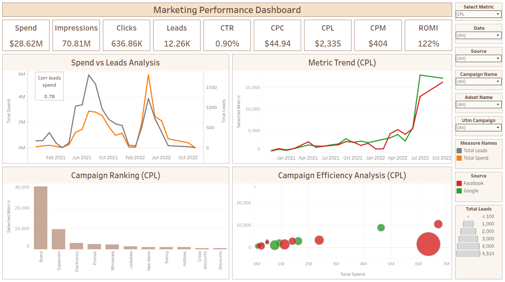

# Marketing Performance & Attribution Analysis

An end-to-end analytical project that evaluates cross-channel marketing efficiency across **Facebook Ads** and **Google Ads**. Raw daily ad logs and campaign metadata are cleaned and unified in **PostgreSQL**, then visualized as an interactive executive dashboard in **Tableau** designed to optimize budget allocation and reduce Cost Per Lead.

| | |
| :--- | :--- |
| **Role** | End-to-end: SQL data prep, metric design, dashboard build |
| **Tools** | PostgreSQL / DBeaver, Tableau Public |
| **Data** | Synthetic training dataset (GoIT Data Analytics course) — Facebook Ads and Google Ads daily logs |
| **Period covered** | February 2021 – December 2022 |
| **Deliverable** | Live Tableau dashboard + SQL query + presentation PDF |

🔗 **Live Dashboard:** [Marketing Performance Dashboard (Tableau Public)](https://public.tableau.com/app/profile/olha.rudnieva/viz/Project2Tableau_17853332767450/MarketingPerformanceDashboard)
📄 **Presentation:** [Presentation.pdf](Presentation.pdf) — executive summary slides

---

## Project Overview

The analysis covers 22 months of paid acquisition activity (February 2021 – December 2022), spanning **$28.62M in ad spend**, **70.81M impressions**, **636.86K clicks**, and **12.26K generated leads**.

**Business questions addressed**

* Does increasing ad spend reliably increase lead volume, or are we hitting diminishing returns?
* How does acquisition efficiency (CPL, CPC, CTR) trend over time, and on which platform?
* Which campaigns deliver leads at the lowest cost, and which ones consume budget disproportionately?
* Where should budget be reallocated to improve overall return on marketing investment?

---

## Repository Structure

* [**`PostgresSQL.sql`**](./PostgresSQL.sql): PostgreSQL script that blends both ad platforms into a single dataset — dictionary mapping via `LEFT JOIN`, cross-platform union via `UNION ALL`, NULL handling with `COALESCE`, URL-decoding of tracking parameters, and `utm_campaign` extraction.
* [**`Presentation.pdf`**](./Presentation.pdf): Executive presentation slides covering methodology, dashboard walkthrough, and business conclusions.
* [**`Dashboard.png`**](./Dashboard.png): Static preview of the final Tableau dashboard.
* [**`Marketing Performance Dashboard`**](https://public.tableau.com/app/profile/olha.rudnieva/viz/Project2Tableau_17853332767450/MarketingPerformanceDashboard): Live interactive report on Tableau Public.

---

## Tech Stack & Skills Applied

* **Database & Querying:** PostgreSQL / DBeaver
  * `LEFT JOIN` against campaign and adset dictionary tables to resolve readable campaign names.
  * `UNION ALL` to blend Facebook and Google data into one comparable grain (date × source × campaign × adset × utm_campaign).
  * `COALESCE` on all metric columns so missing values aggregate as zero instead of dropping rows.
  * A temporary URL-decoding function plus `substring` regex extraction to parse `utm_campaign` out of raw tracking strings, normalizing `nan` and NULL values to `empty`.
* **Business Intelligence & Data Visualization:** Tableau Public
  * Custom **calculated fields** for all cross-channel metrics (CTR, CPC, CPM, CPL, ROMI, conversion rates).
  * **FIXED LOD** expressions for monthly aggregated spend and lead benchmarks.
  * An **interactive parameter** (`Select Metric`) that re-drives every view from a single control.
  * **Dashboard filter actions** enabling drill-down from high-level KPIs to individual campaign performance.

---

## Key Metrics Computed

| Metric | Business Definition | Formula / Logic |
| :--- | :--- | :--- |
| **CTR** | Click-Through Rate | `SUM([Clicks]) / SUM([Impressions])` |
| **CPC** | Cost Per Click | `SUM([Spend]) / SUM([Clicks])` |
| **CPM** | Cost Per Mille (1,000 impressions) | `SUM([Spend]) / SUM([Impressions]) * 1000` |
| **CPL** | Cost Per Lead | `SUM([Spend]) / SUM([Leads])` |
| **ROMI** | Return on Marketing Investment | `(SUM([Value]) - SUM([Spend])) / SUM([Spend])` |
| **Lead Correlation** | Pearson correlation coefficient (r) | `CORR([Monthly Spend], [Monthly Leads])` |

**Headline results:** CTR 0.90% • CPC $44.94 • CPL $2,335 • CPM $404 • ROMI 122%

---

## Key Insights Summary

* **Spend predicts leads reliably (r = 0.78).** The Pearson correlation between monthly ad spend and monthly leads is **0.78** — a strong positive linear relationship. Scaling budget drives lead volume without hitting immediate diminishing returns, so spend increases can be planned with reasonable confidence in the outcome.

* **Cost Per Lead is inflating on both platforms.** Through 2022, CPL trends upward across Facebook and Google alike, with the sharpest climb in the second half of the year. This pattern is characteristic of ad fatigue and points to creative refresh, audience retargeting review, and landing-page conversion optimization rather than simply raising bids.

* **`Brand` campaigns are the clear cost outlier.** Brand campaigns reach **CPL above $30,000** in peak periods — roughly three times the next-most-expensive campaign — driven by aggressive bidding on brand keywords. Mid-funnel campaigns such as `Expansion` and `Promos` deliver comparable or better lead volume at substantially lower acquisition cost.

* **Efficiency and scale are not aligned.** The Spend vs. Performance scatter shows the highest-spend campaigns clustered at mid-range lead counts, meaning the largest budgets are not the most productive ones.

### Business Recommendations

Reallocate a portion of the `Brand` search budget toward high-performing `Expansion` campaigns, where leads are acquired at materially lower cost. Pair the reallocation with a creative and audience refresh to address the CPL inflation trend, and re-measure the spend-to-lead correlation afterward to confirm efficiency has improved rather than simply shifted.

---

## Dashboard Features

1. **Dynamic metric selector:** A single parameter switches every view — trend lines, campaign ranking, and the efficiency scatter plot — between CTR, CPC, CPL, ROMI, and Leads.
2. **Campaign efficiency scatter plot:** Plots campaigns on a Spend vs. Performance matrix, sized by lead volume and colored by platform; doubles as an interactive filter for single-campaign deep-dives.
3. **Cross-cutting filter panel:** Date, Source, Campaign Name, Adset Name, and UTM Campaign controls applied consistently across all views.
4. **Fixed-size layout:** Tuned for stakeholder presentation without metric clipping or scrollbars.

---

## Dashboard Preview

