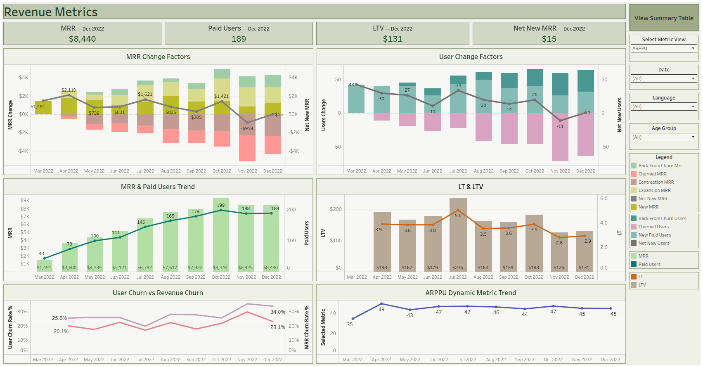
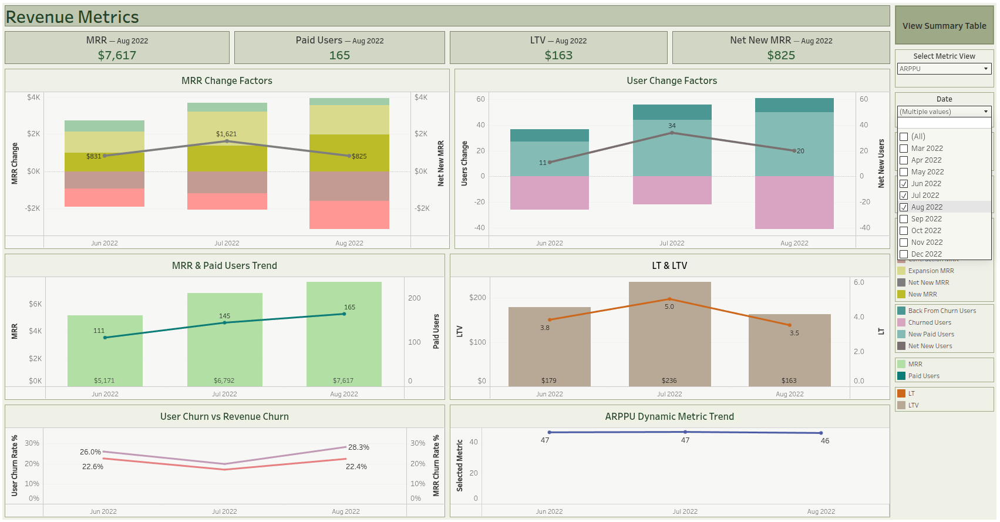
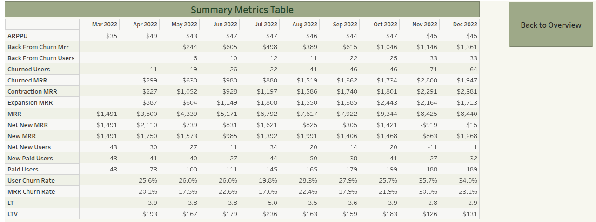

# План презентації проєкту 'Revenue Metrics Dashboard'

## Посилання на готовий Tableau Public дашбоард

https://public.tableau.com/app/profile/olha.rudnieva/viz/RevenueMetricsFilter/RevenueMetrics

## Посилання на готову презентацію

https://www.canva.com/design/DAHViAzxDiQ/bbql2XbmzZnkf0on0a8G2A/edit
https://canva.link/ofl5ozg8gzwzd96

File: [Revenue Metrics Dashboard.pdf](Revenue%20Metrics%20Dashboard.pdf)

## Screenshot

## SQL для отримання даних

[query.sql](query.sql)

## Проєкт 2. Revenue metrics

Завдання до проєкту:

Створити дашборд для аналізу грошових надходжень на проекті. За його допомогою (уявні) продуктові менеджери будуть відслідковувати динаміку змін грошових надходжень та робити верхньорівневий аналіз факторів цих змін.

Дашборд має включати всі, або хоча б більшість з таких метрик:
Monthly Recurring Revenue (MRR) - це сума revenue за календарний місяць, але лише за умови що це revenue було отримано з джерел, які повторюються з місяця в місяць.
Paid Users - кількість користувачів, що є платящими.
Average Revenue Per Paid User (ARPPU) - середнє revenue на користувача, що платить. Розраховується як ARPPU = Revenue / Paid Users.
New Paid Users - кількість користувачів, що стали платити у відповідний період часу.
New MRR - це MRR згенерований користувачами, що стали платними у відповідний місяць.
Churned Users - кількість користувачів що припинили платити у відповідний період часу.
Churn Rate - це співвідношення Churned Users у цільовий період часу до Paid Users у попередній період. Наприклад, Churn Rate(June) = Churned Users(June) / Paid users(May)
Churned revenue - сумарний revenue за попередній період від усіх користувачів, що припинили платити.
Revenue Churn rate - це співвідношення revenue за попередній місяць від тих користувачів користувачів що не продовжили платити до revenue за певний календарний місяць. Наприклад, Revenue Churn Rate(June) = Churned Revenue (June) / MRR(May)
Expansion MRR - це сума, на яку збільшилася MRR від одного місяця до іншого. Рахується за користувачами, що стали платити більше в поточному місяці.
Contraction MRR - це сума, на яку зменшилася MRR від одного місяця до іншого. Рахується за користувачами, що стали платити менше в поточному місяці.
Customer LifeTime (LT) - це середня кількість часу від першої оплати до відвалу користувачів. Тобто весь час, котрий з продуктом залишається середньостатистичний користувач.
Customer LifeTime Value (LTV) - це середня загальна сума, котру один юзер сплачує за весь час користування продуктом. Тобто всі гроші, котрі сплачує компанії середньостатистичний користувач.
Важливо: більш детально ці метрики описані в уроці 26 в навчальному блоці 2.

Дашборд має:
складатися з, принаймні, пʼяти діаграм,
включати фільтри за датою, мовою користувача та віком користувача.

Серед діаграм на графіку обовʼязково мають бути, принаймні, дві, що показують фактори зміни revenue та paid users від місяця до місяця.

Наприклад:

Важливо: тобi не обовʼязково робити таку саму діаграму, як і на зображення. Ти можеш обрати спосіб візуалізації, але головне - наглядно показати, за рахунок чого змінюється revenue та paid users від місяця до місяця.

Для візуалізації рекомендуємо використати Tableau. Ти самостійно визначаєш структуру дашборду та його оформлення. Але рекомендуємо керуватися принципами, що були розглянуті в темі “Принципи візуалізації та побудови дашбордів” в Навчальному блоці 4.

Важливо: дані для виконання цього завдання зберігаються в схемі “project” в тій самій БД на PostgreSQL, в якій ми робили домашні завдання в блоці SQL.

Формат здачі проєкту:

Виконана задача має складатися з двох частин:
1. Запит в SQL Збережи запит у вигляді .sql файлу та завантаж його у форму здачі цього завдання.
2. Дашборд в Tableau Public. Посилання (з відкритим доступом для перегляду) на звіт встав у текстове поле для здачі домашньої роботи.

## Критерії прийому проєкту:

Створено дашборд в Tableau Public
Дашборд доступний усім користувачам в Інтернеті.
Дашборд містить дані, що отримані через написання запиту до таблиць в схемі “project” в БД, до якої тобі надав доступ ментор.
Дашборд містить, принаймні, десять з перелічених показників: Monthly Recurring Revenue (MRR), Paid Users, Average Revenue Per Paid User (ARPPU), New Paid Users, New MRR, Churned Users, Churn Rate, Churned revenue, Revenue Churn rate, Expansion MRR, Contraction MRR, Customer LifeTime (LT), Customer LifeTime Value (LTV).
Дашборд містить фільтри за датою, мовою користувача та віком користувача.
Дашборд містить, принаймні, пʼять діаграм.
Дашборд містить дві діаграми, що показують фактори зміни revenue та paid users від місяця до місяця.
Візуальне оформлення дашборду відповідає принципам, описаним в домашньому завданні до теми 6 “Принципи візуалізації та побудови дашбордів” в навчальному блоці 3:
Принцип 5 секунд;
Розташування важливої інформації;
Позначення метрик та підписи;
Використання кольорової схеми.

## CHECKLIST для проведення презентації проєкту

Презентацію проєкту необхідно розпочинати з ІДЕЇ самого проєкту! Уявіть, що ваше завдання - представити проєкт/стартап інвестору. Детально розкажіть про вашу роботу та про сам проєкт - роботодавець оцінить це.

Підготовка до презентації
До презентації необхідно підготувати матеріали:
посилання на дашборд проєкту в Tableau Public
посилання на запити в BigQuery (для проєкту 1)
запит в SQL (для проєкту 2)

Рекомендуємо підготувати та презентувати спочатку захисту проєкту слайд Про проєкт: 
назва
головна ідея проєкту
термін виконання
функціонал
стек використовуваних технологій

Загальні рекомендації:
● Обов'язкова візуалізація проєкту.
Проведення презентації з погляду користувача. Як користувач може користуватися дашбордом. Рекомендуємо персоналізувати презентацію та гейміфікувати - познайомити з користувачем (вигадати йому ім'я, вік, хобі).
● Під час візуального представлення, інформування про виконану роботу
● Логічна послідовність презентації. По блоках – зверху вниз.
● Пам'ятайте про чітку структуру, яка відповідає плану презентації.
● Налаштуйтеся позитивно та обов'язково увімкніть камери.

## ПЛАН ПРЕЗЕНТАЦІЇ
1. Представлення проєкту. Структуруйте свій виступ тезисно, виступ не має перевищувати 5-7 хвилин. Вам варто розповісти головні висновки вашого проєкту, окреслити головні результати.
   Допоміжні питання:
- Завдання, яке стояло перед вами? Що було зроблено для вирішення завдання?
- Які складнощі були? Як ви їх вирішили? 
2. Після демонстрацiї всіх блоків, розкажiть, які висновки ви зробили після роботи над проєктом. Не забудьте подякувати проєктному ментору за допомогу над роботою з проєктом.
3. Завершення презентації. 

І пам'ятаємо, розповідаючи про складнощі в роботі та шляхи їх вирішення – ми залучаємо роботодавця, а не відлякуємо.

Навчити студента/співробітника/стажера можна завжди. Роботодавцю завжди цікаво знати з якими труднощами зустрівся кандидат і як саме він їх вирішував. Одна з головних переваг на співбесіді - чи вміє потенційний співробітник проводити роботу над помилками та робити висновки.

Тому що у роботі завжди будуть «фейли» та «факапи», але те, як ми їх швидко вирішуємо і робить з нас крутих фахівців – такі будуть у ціні завжди!

### Презентація

**Бриф для генератора презентації (Canva)**

- Назва презентації: Revenue Metrics Dashboard
- Підзаголовок: Аналіз регулярного виторгу та факторів зміни MRR у SaaS-продукті
- Автор: Оля Руднєва, Data Analyst
- Кількість слайдів: 8
- Тривалість виступу: 5–7 хвилин
- Кольорова палітра: оливково-шавлієвий зелений + білий, темно-сірий текст (у тон дашборду)
- Стиль: чисті бізнес-слайди, мінімум тексту, великі скріншоти дашборду
- Посилання 1 (дашборд): https://public.tableau.com/app/profile/olha.rudnieva/viz/RevenueMetricsFilter/RevenueMetrics
- Посилання 2 (SQL-запит): query.sql у репозиторії проєкту
- Зображення для слайдів (лежать у цій самій папці):
  - `RevenueMetricsDashboard.png` — головний екран, усі фільтри = (All)
  - `RevenueMetricsDashboard_with_date_filer.png` — той самий екран із фільтром Date = Jun/Jul/Aug 2022
  - `RevenueMetricsDashboard_summary_table.png` — екран Summary Metrics Table

---

**Слайд 1. Обкладинка та паспорт проєкту**

Заголовок: Revenue Metrics Dashboard — аналіз регулярного виторгу SaaS-продукту

Головне питання (великим шрифтом, центр слайда — це те, що глядач має прочитати за 5 секунд):
**«Ми справді ростемо — чи нові продажі просто перекривають те, що ми втрачаємо?»**

Візуал: `RevenueMetricsDashboard.png` (зменшено, як тло або превʼю праворуч) + QR-код на дашборд

Текст на слайді:
- Оля Руднєва, Data Analyst
- Стек: PostgreSQL (CTE, віконні функції) + Tableau Public
- Дані: Mar–Dec 2022, 17 метрик, 6 діаграм + Summary Metrics Table
- Дашборд у Tableau Public (посилання / QR)
- SQL-запит: query.sql у репозиторії

🗣 Скрипт виступу:
«Вітаю! Мене звати Оля, і я покажу проєкт Revenue Metrics Dashboard.
Почну з питання, на яке він відповідає: ми справді ростемо — чи нові продажі просто перекривають те, що ми втрачаємо? Звучить просто, але жоден графік загального виторгу на це не відповідає: у загальній цифрі зростання і втрати вже змішані. Скажу відразу — для цього продукту відповідь виявилась неприємною. Наприкінці покажу одну цифру, яка її доводить.
Стек і обсяг даних наведені на слайді. Посилання на дашборд і на SQL-запит я виводжу тут же, на першому слайді, — щоб їх можна було відкрити й перевірити просто зараз.»

**Слайд 2. Знайомство з користувачем**

Заголовок: Для кого дашборд і яку бізнес-проблему він закриває

Візуал: іконка/аватар персони ліворуч, праворуч — три цитати-бабли; без скріншота

Текст на слайді:
- Персона: Барак, Head of Product
- Відповідає за зростання, монетизацію та Retention
- Його питання — те саме: «Ростемо чи перекриваємо втрати?»
- Чому графік виторгу не відповідає: зростання і втрати в ньому змішані
- Що потрібно: розділити їх → 5 чинників MRR + чистий результат Net New MRR
- Одна цифра-відповідь: Net New MRR — «скільки насправді залишилось»

🗣 Скрипт виступу:
«Спершу я визначила, для кого роблю дашборд. Наш користувач — Head of Product, назвемо його Барак. Він відповідає за зростання, монетизацію і за те, щоб клієнти залишалися з нами якнайдовше.
Його щомісячний біль звучить так: виторг наче нормальний, але що відбувається під капотом — не видно. Тобто це те саме питання, з якого я почала. І графік загального виторгу на нього відповісти не може: місяць, у якому ми заробили багато і втратили стільки ж, виглядає точно так само, як місяць справжнього зростання.
Тому дашборд робить одну головну річ — розділяє заробіток і втрати. Виторг розкладено на пʼять чинників, вони перелічені на слайді. А вся відповідь зводиться до однієї метрики — Net New MRR: скільки грошей насправді залишилось після всіх втрат.»

**Слайд 3. Складність №1: трансформація даних і захист методології**

Заголовок: Складність №1: відтік «зникав» при виборі одного місяця

Візуал: без зображення (схема з двох блоків: «payment-рядок» → «churn_check-рядок на payment_month+1», обидва з однаковим metric_month)

Текст на слайді:
- PostgreSQL: ланцюг CTE + віконні LAG() / LEAD()
- 5 чинників MRR: New, Expansion, Contraction, Churn, Back from Churn
- Проблема: LOOKUP(SUM(...), -1) давав NULL при виборі одного місяця
- Рішення: датування відтоку перенесено в SQL — churn_check на payment_month+1
- Тепер Churn Rate, LT, LTV, Net New MRR — прості відношення SUM()
- Побічний баг: у фільтрі дат зʼявився фантомний Jan 2023 → обмежив гілку
- Waterfall відкинуто: складав відтік догори й роздував стовпчик MRR

🗣 Скрипт виступу:
«В основі дашборду — SQL-запит у PostgreSQL: віконними функціями я порівнюю платежі кожного користувача з сусідніми місяцями і так розкладаю виторг на пʼять чинників.
Але найцікавіше було не в самому SQL. Спочатку Churn Rate я рахувала в Tableau — табличним розрахунком зі зсувом на місяць назад. І воно працювало. Рівно до моменту, коли я сама, вже для перевірки, обрала у фільтрі один місяць — і графіки відтоку стали порожні. Причина виявилась банальна: фільтр викидає рядок попереднього місяця ще до того, як розрахунок узагалі запуститься. Тобто дивитися було на що.
Я не стала обходити це в Tableau, а перебудувала дані: тепер кожен платіж породжує два рядки — сам платіж і рядок-перевірку відтоку, датований наступним місяцем. Обидва лежать на одній мітці часу, тому і відтік, і його база — в одному місяці. Після цього майже всі метрики стали звичайними сумами, без табличних розрахунків.
Цей зсув одразу підкинув побічний баг, і теж помітний тільки у фільтрі: усі, хто платив у грудні, отримали відтік у січні 2023 — фантомний місяць, у якому весь грудневий виторг наче обвалювався в нуль. Хоча там просто закінчуються дані. Обмежила гілку останнім реальним місяцем — і у фільтрі залишилось рівно десять справжніх місяців.
І окремо про вибір діаграми. Я пробувала класичний Waterfall, але він складав відʼємний Churn догори й роздував стовпчик виторгу. Тому обрала MRR Change Factors: плюси вгору від нуля, мінуси вниз, а лінія показує чистий результат.»

**Слайд 4. Складність №2: KPI-картки і фільтр дат**

Заголовок: Що таке «останній місяць», коли користувач змінює фільтр?

Візуал: два кропи рядка KPI-карток один під одним — з `RevenueMetricsDashboard.png` («MRR — Dec 2022 · $8,440») і з `RevenueMetricsDashboard_with_date_filer.png` («MRR — Aug 2022 · $7,617»); між ними стрілка «Date = Jun–Aug 2022»

Текст на слайді:
- Картка має показувати «де ми зараз» — а це залежить від фільтра
- Хибний варіант 1: SUM() за весь період → MRR $63,141 біля стовпчика $8.4K
- Хибний варіант 2: жорстко зашитий Dec 2022 → картка не реагує на фільтр
- Сумувати LTV чи Net New MRR за 10 місяців — арифметично безглуздо
- Рішення: LAST() = 0 з напрямком розрахунку вздовж осі місяців
- «Останній» перераховується всередині вибірки → картка сама стає «— Aug 2022»
- Той самий розрахунок підставляє місяць у заголовок картки

🗣 Скрипт виступу:
«Друга складність була вже не в даних, а в логіці самих KPI-карток. Картка має відповідати на питання «де ми зараз». Але «зараз» — це не фіксований місяць, а останній місяць того періоду, який користувач обрав у фільтрі. І тут я двічі зробила неправильно, перш ніж зробила правильно.
Перший варіант — звичайна сума за весь період. Саме так у першій версії працювала картка MRR: на ній стояла сума за десять місяців, а поряд стовпчик того ж MRR за грудень — $8.4 тисячі. Одне й те саме слово «MRR» на одному екрані означало дві різні речі. А LTV чи Net New MRR складати за місяцями взагалі безглуздо — це зріз і приріст, а не потік.
Другий варіант — просто зашити грудень. Цифра правильна, але картка перестає реагувати на фільтр.
Рішення — розрахункове поле на основі LAST() = 0, і тут важлива деталь: напрямок розрахунку я задала явно вздовж осі місяців, а не «по таблиці». Інакше він привʼязується до сітки екрана і збивається, щойно фільтр змінює кількість стовпців. Тепер «останній місяць» перераховується сам при кожній зміні фільтра — і те саме поле підставляє назву місяця в заголовок картки. Тому картку вже не можна прочитати неправильно: вона сама називає свій місяць.»

**Слайд 5. Головний екран і KPI-картки**

Заголовок: Головний екран: чотири KPI з динамічними заголовками

Візуал: `RevenueMetricsDashboard.png` на весь слайд; окремими кропами — рядок із чотирьох KPI-карток і кнопка **View Summary Table** у правому верхньому куті (обвести)

Текст на слайді:
- MRR — Dec 2022: $8,440 (зріз місяця, не сума періоду)
- Paid Users — Dec 2022: 189 · LTV — Dec 2022: $131
- Net New MRR — Dec 2022: усього $15
- Заголовок картки сам називає місяць — нуль двозначності
- 6 діаграм + параметр Select Metric View + фільтри Date / Language / Age
- Кнопка **View Summary Table** → другий екран; **Back to Overview** → назад
- Два екрани замість перевантаженого одного: огляд і точні цифри окремо

🗣 Скрипт виступу:
«Тепер сам дашборд. Єдина оливково-зелена схема, один заголовковий блок, згрупована легенда і колонка фільтрів праворуч — усе, що керує екраном, зібрано в одному місці.
Угорі — ті самі чотири картки: кожна називає свій місяць, зараз це грудень. Решта значень наведена на слайді.
І ось головне. За грудневим MRR у $8,440 здається, що все спокійно. А чистий приріст — п'ятнадцять доларів. Розкладка на слайді: плюси й мінуси майже дорівнюють одне одному. Це класичне «діряве відро» — ми заробляємо, і майже все витікає. Для Барака це перший сигнальний прапорець.
І ще одна деталь, яку я додала свідомо: у правому верхньому куті є кнопка View Summary Table. Дашборд складається з двох екранів — оглядового і таблиці з точними цифрами, — і між ними можна переходити одним кліком, кнопкою туди й кнопкою Back to Overview назад. Я не стала складати все на один екран: огляд має відповідати на питання за пʼять секунд, а точні цифри потрібні не завжди й не всім.»

📌 Додатковий текст для захисту (якщо запитають про дублювання в картках і на графіку):
«Це свідоме UX-рішення для Head of Product. KPI-картки — це швидкий "пульс бізнесу": точний зріз останнього місяця з підписаним у заголовку періодом, без потреби шукати крайню точку на графіку. Графіки нижче дають контекст — історичний тренд тієї самої метрики. Плюс картки реагують на фільтр дат і перепідписуються, тож вони не дублюють графік, а відповідають на інше питання: "де ми зараз".»

**Слайд 6. Факторний аналіз і крива відтоку**

Заголовок: Аномалія року — листопад 2022

Візуал: кроп із `RevenueMetricsDashboard.png` — діаграми MRR Change Factors, User Change Factors і User Churn vs Revenue Churn

Текст на слайді:
- Nov 2022: Churned MRR -$2,800, Churned Users -71
- Net New MRR провалився у мінус: -$919
- User Churn Rate: 25.6% (Apr) → пік 35.7% (Nov) → 34.0% (Dec)
- MRR Churn Rate: 20.1% (Apr) → пік 30.0% (Nov) → 23.1% (Dec)
- LT впав з 5.0 до 2.9 міс., LTV — з $236 до $131

🗣 Скрипт виступу:
«А ось тут видно найцікавіше — і саме заради цього дашборд і будувався. Головна аномалія року, листопад.
Загальний виторг у листопаді виглядав майже нормально. Але чистий приріст провалився в мінус — мінус $919. Тобто місяць ми закінчили бідніші, ніж почали, хоча за загальною цифрою цього не видно. Причина — пік відтоку, конкретні значення на слайді.
Криві відтоку це підтверджують: користувацький відтік дійшов до 35.7% у листопаді, і ми втрачаємо і людей, і гроші одночасно.
А наслідок — на діаграмі LT та LTV: цінність клієнта впала з $236 до $131, майже вдвічі, а середній час життя — з пʼяти місяців до трьох. Для Head of Product це вже не сигнал, а діагноз: у другій половині року щось зламалося в утриманні.»

**Слайд 7. Інтерактивність: фільтри та деталізація**

Заголовок: Один клік у фільтрі — і весь дашборд переписується

Візуал: два скріншоти поруч — `RevenueMetricsDashboard_with_date_filer.png` (Date = Jun–Aug 2022) і `RevenueMetricsDashboard_summary_table.png`

Текст на слайді:
- Date = Jun–Aug 2022 → картки самі стають «— Aug 2022»
- Aug 2022: MRR $7,617 · Paid Users 165 · LTV $163 · Net New MRR $825
- Усі 6 діаграм перечитуються під вибраний період
- Фільтри Language та Age Group + параметр Select Metric View
- Summary Metrics Table: 17 метрик × Mar–Dec 2022, кнопки навігації
- Grand Totals свідомо вимкнено: зріз + потік + % не сумуються

🗣 Скрипт виступу:
«Тепер найдемонстративніше — інтерактивність. Дивіться, що буде, якщо Барак залишить у фільтрі лише червень, липень і серпень. Картки не просто змінюють цифри — вони самі перепідписуються: тепер це «MRR — Aug 2022», бо останній місяць у вибірці тепер серпень. Значення на слайді. Одночасно перечитуються всі шість діаграм.
Саме заради цього я й переносила логіку відтоку в SQL: на табличних розрахунках цей момент просто ламався.
Так само працюють фільтри за мовою та віковою групою, а параметр Select Metric View виводить на нижню діаграму будь-яку з метрик — тут вибрано ARPPU.
А коли Барак хоче точні цифри, він тисне View Summary Table і бачить усі 17 метрик по місяцях. Одна деталь: у цій таблиці я свідомо вимкнула підсумковий рядок. У ній поруч лежать зрізи, потоки й відсотки — складати їх в один підсумок просто неправильно, і краще не показати нічого, ніж показати цифру, якій не можна вірити.»

**Слайд 8. Висновки та рекомендації**

Заголовок: Відповідь на головне питання

Відповідь (великим шрифтом, вгорі слайда — дзеркало слайда 1):
**Питання: «Ми ростемо — чи перекриваємо втрати?»**
**Відповідь: перекриваємо. MRR $8,440 — а Net New MRR лише $15.**

Візуал: `RevenueMetricsDashboard.png` як бліде тло + блок «Дякую» з посиланням/QR на дашборд

Текст на слайді:
- Проблема №1 — Retention: User Churn 25.6% → 35.7% (Nov), 34% (Dec)
- Проблема №2 — Contraction MRR стабільно високий: -$2,381 у грудні
- «Діряве відро»: +$4,342 проти -$4,328 → Net New MRR $15
- LTV впав з $236 до $131, LT — з 5.0 до 2.9 місяця
- Рекомендація 1: шукати причину відтоку в перші 2–3 місяці життя клієнта
- Рекомендація 2: ревізія дорогих тарифів, щоб зменшити Contraction
- Наступний крок: когортний retention-аналіз — цей дашборд його не замінює

🗣 Скрипт виступу:
«Повернімося до питання, з якого я починала: ми ростемо — чи просто перекриваємо втрати? Відповідь дашборду: перекриваємо. За грудень MRR — $8,440, і за загальною цифрою рік виглядає як рік зростання. А чистий приріст — п'ятнадцять доларів. Фактично зростання зупинилось, і побачити це можна тільки розклавши виторг на чинники.
З цього — три висновки.
Перший і головний: проблема не в залученні, а в утриманні. Нових клієнтів ми приводимо добре, але відтік зростає, а цінність клієнта впала майже вдвічі — з $236 до $131. Цифри на слайді.
Другий: клієнти не так ідуть, як зменшують чеки й переходять на дешевші тарифи. Це означає, що цінність дорогих планів для них неочевидна.
Третій: у плюсі ми втримались головним чином завдяки тим, хто повернувся. Тобто зростання тримається на поверненнях — це нестійка модель.
І про досвід. Найбільше мене навчила історія з відтоком, який зникав при виборі одного місяця. Найпростіше було б обійти це костилем, але я перебудувала модель даних — і саме це зробило дашборд по-справжньому інтерактивним, а не просто гарним.
Дякую за увагу! Буду рада фідбеку.»

📌 Додатковий текст для захисту (якщо запитають: «а де саме на дашборді видно, що проблема в онбордингу?»):
«Прямо — ніде, і це важливо сказати чесно. Дашборд показує, **що** утримання ламається і **наскільки**: відтік зростає, середній час життя клієнта — близько трьох місяців, тобто типовий користувач іде до третього-четвертого платежу. Він не показує, **на якому саме кроці** продукту це відбувається — для цього потрібен когортний retention-аналіз по кроках воронки, а це вже інший дашборд. Тому «онбординг» тут — не висновок із даних, а гіпотеза, куди дивитися першою, і вона взята з LT: якщо клієнт живе три місяці, причина майже завжди в перших тижнях, а не в п'ятому місяці.
Що дашборд усе ж дозволяє зробити зараз — це звузити пошук: фільтри за мовою та віковою групою показують, у якому сегменті відтік найвищий. З цього можна почати, ще не маючи когортного аналізу.»
